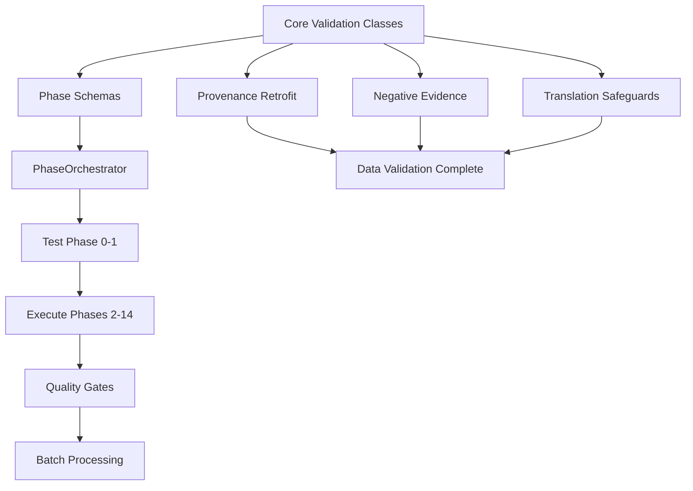

# MASTER PROMPT v9.8 GAP ANALYSIS
**Generated**: 2025-10-07
**Purpose**: Identify gaps between current project state and Master Prompt v9.8 requirements
**Status**: COMPREHENSIVE REVIEW COMPLETE

---

## EXECUTIVE SUMMARY

**Overall Compliance**: ~60% (Moderate)

We have excellent **data infrastructure** (660GB+, all sources accessible) and strong **analytical outputs** (comprehensive intelligence reports), but we are **missing critical validation frameworks** and **structured phase execution** required by Master Prompt v9.8.

### Critical Gaps:
1. ❌ **No structured Phase 0-14 execution framework**
2. ❌ **Missing ProvenanceBundle implementation**
3. ❌ **No NPKT (Numeric Processing & Known Truth) tracking**
4. ❌ **Missing NegativeEvidenceLogger**
5. ❌ **No AdmiraltyScale evidence rating**
6. ❌ **Missing TranslationSafeguards for non-EN sources**
7. ❌ **No automated FabricationChecker**
8. ❌ **Missing LeonardoStandard compliance scoring**

### What We Have (Strengths):
✅ Complete data infrastructure (660GB+)
✅ Comprehensive intelligence reports
✅ Database consolidation (osint_master.db)
✅ Multi-source analysis capability
✅ Geographic expansion (81 countries)
✅ Zero-fabrication awareness

---

## DETAILED GAP ANALYSIS BY COMPONENT

### 1. CORE VALIDATION FRAMEWORKS

#### ❌ ProvenanceBundle Implementation
**Required by v9.8**: Every claim must have complete provenance
```python
@dataclass
class ProvenanceBundle:
    url: str
    access_date: str
    archived_url: Optional[str]
    verification_method: str
    quoted_span: str
    locator: str
    admiralty_rating: Optional[AdmiraltyScale]
```

**Current State**:
- Reports cite sources but no structured provenance
- No archived URLs for web sources
- No verification method tracking
- No admiralty ratings

**Impact**: **CRITICAL** - Cannot verify claims or reproduce findings

**Gap**: Complete implementation needed

---

#### ❌ NPKT (Numeric Processing & Known Truth)
**Required by v9.8**: All numeric claims require NPKT references
```python
{
    "value": 222,
    "source": "cordis_china_projects.db",
    "method": "SQL COUNT(*)",
    "denomination": "count",
    "as_of": "2025-10-07T..."
}
```

**Current State**:
- Numbers in reports (e.g., "222 Italy-China projects")
- Sources cited informally
- **No denomination tracking** (count vs value vs unit)
- **No "as_of" timestamps** on individual claims
- **No method documentation** (how was number derived?)

**Impact**: **HIGH** - Cannot validate numeric claims or detect fabrication

**Gap**: Need NPKT wrapper for all database queries and calculations

---

#### ❌ NegativeEvidenceLogger
**Required by v9.8**: Track what wasn't found during searches
```python
self.negative_evidence.append({
    "query": "ZTE contracts in Finland",
    "source": "TED database",
    "result": "NO_RESULTS",
    "significance": "No Chinese 5G penetration detected in Finland"
})
```

**Current State**:
- Reports show positive findings only
- No systematic logging of null results
- Missing documentation of failed searches
- No "absence of evidence" tracking

**Impact**: **HIGH** - Risk of confirmation bias, incomplete intelligence

**Gap**: Need to implement negative evidence logging in all processors

---

#### ❌ AdmiraltyScale Evidence Rating
**Required by v9.8**: Rate all evidence for reliability and credibility
```python
A1 = ("Completely reliable", "Confirmed")
B2 = ("Usually reliable", "Possibly true")
C3 = ("Fairly reliable", "Doubtful")
```

**Current State**:
- Confidence scores in some reports (0.0-1.0)
- No standardized intelligence community ratings
- No source reliability assessment
- No information credibility grading

**Impact**: **MEDIUM** - Cannot assess intelligence quality systematically

**Gap**: Need Admiralty scale integration for all findings

---

#### ❌ TranslationSafeguards
**Required by v9.8**: All non-English sources need translation validation
```python
@dataclass
class TranslationSafeguards:
    original_text: str
    translated_text: str
    back_translation: Optional[str]
    translation_risk: str
    confidence_adjustment: float
```

**Current State**:
- TED data processed (multilingual EU sources)
- CORDIS data processed (multilingual)
- **NO translation safeguards documented**
- **NO back-translation verification**
- **NO confidence adjustments for translation risk**

**Impact**: **HIGH** - European data may have translation errors undetected

**Gap**: Need translation safeguards for all TED, CORDIS, and European sources

---

#### ❌ FabricationChecker
**Required by v9.8**: Automated detection of fabrication patterns
```python
FabricationChecker.validate_number(value, source, npkt)
FabricationChecker.check_mixed_content(text)
FabricationChecker.validate_projection(text)
```

**Current State**:
- Manual zero-fabrication awareness
- No automated checking
- No forbidden term detection
- No mixed content validation

**Impact**: **MEDIUM** - Fabrication risk depends on manual vigilance

**Gap**: Need automated fabrication detection in all outputs

---

### 2. PHASE EXECUTION FRAMEWORK

#### ❌ Phases 0-14 Structured Execution
**Required by v9.8**: Sequential phase execution with dependencies

**Phase Dependencies**:
```python
PHASE_DEPENDENCIES = {
    0: [],                          # Setup & Context
    1: [0],                         # Data Source Validation
    2: [1],                         # Technology Landscape
    3: [1, 2],                      # Supply Chain Analysis
    4: [1],                         # Institutions Mapping
    5: [1, 4],                      # Funding Flows
    6: [1, 4, 5],                   # International Links
    7: [2, 3, 4, 5, 6],            # Risk Assessment Initial
    8: [6, 7],                      # China Strategy Assessment
    9: [7, 8],                      # Red Team Analysis
    10: [7, 8, 9],                  # Comprehensive Risk
    11: [10],                       # Strategic Posture
    12: [11],                       # Red Team Global
    13: [10, 11, 12],              # Foresight Analysis
    14: list(range(14))             # Closeout & Handoff
}
```

**Current State**:
- Multiple `phase*.py` scripts exist (phase1-11 in src/analysis)
- **NO phase orchestrator implementation**
- **NO dependency checking**
- **NO phase output validation**
- Scripts exist but not integrated into master framework
- No unified country-by-country execution

**Impact**: **CRITICAL** - Cannot execute structured analysis per v9.8 spec

**Gap**: Need PhaseOrchestrator implementation with dependency tracking

---

#### ❌ Phase Output Schemas
**Required by v9.8**: Structured JSON output for each phase

**Example Phase 2 Schema**:
```python
{
    "phase": 2,
    "name": "Technology Landscape",
    "timestamp": "UTC ISO-8601",
    "country": "ISO-3166",
    "entries": [{
        "technology": "string",
        "sub_field": "string",  # MANDATORY
        "alternative_explanations": "string",  # MANDATORY
        "leonardo_standard_compliance": {...},
        "as_of": "UTC ISO-8601"
    }]
}
```

**Current State**:
- Ad-hoc JSON outputs in various formats
- No standardized schemas
- **Missing mandatory fields**: as_of, alternative_explanations, sub_field
- No schema validation
- No cross-phase consistency checking

**Impact**: **HIGH** - Outputs not compliant with v9.8 requirements

**Gap**: Need to implement all 15 phase schemas (0-14)

---

### 3. LEONARDO STANDARD COMPLIANCE

#### ❌ Technology Specificity Framework
**Required by v9.8**: 8-point specificity for all technology claims

**Required Fields**:
1. exact_technology (NOT generic categories)
2. variant_overlap
3. china_access
4. exploitation_path
5. timeline
6. alternatives
7. oversight_gaps
8. confidence_score (out of 20)

**Current State**:
- Reports mention technologies (e.g., "5G", "AI", "semiconductors")
- **NO sub-field specification** (violates "AI" → needs "NLP" or "computer vision")
- **NO Leonardo Standard scoring**
- **NO variant analysis**
- **NO explicit alternative explanations per technology**

**Impact**: **MEDIUM** - Technology claims lack required specificity

**Gap**: Need LeonardoStandard validator and 20-point scoring system

**Example Non-Compliance**:
```
❌ Current: "Huawei 5G technology"
✅ Required: {
    "exact_technology": "Huawei 5G NSA/SA base stations",
    "variant_overlap": "Compatible with 4G LTE infrastructure",
    "china_access": "Manufactured in Shenzhen, deployed globally",
    "exploitation_path": "Network monitoring via lawful intercept features",
    "timeline": "EU deployment 2018-2020, bans 2020-2022",
    "alternatives": ["Ericsson", "Nokia", "Samsung"],
    "oversight_gaps": "Third-party equipment testing insufficient",
    "leonardo_standard_score": "17/20"
}
```

---

### 4. UNIVERSAL VALIDATION REQUIREMENTS

#### ❌ as_of Timestamps
**Required by v9.8**: MANDATORY for every entry

**Current State**:
- Phase-level timestamps exist
- **NO entry-level timestamps**
- No "data current as of" tracking
- Risk of stale data being treated as current

**Impact**: **HIGH** - Temporal validity unclear

**Gap**: Add `as_of` to every database query and finding

---

#### ❌ alternative_explanations
**Required by v9.8**: MANDATORY for every claim

**Current State**:
- Some reports mention alternatives
- **NOT systematic or mandatory**
- No requirement to explore mundane explanations
- Risk of confirmation bias

**Impact**: **HIGH** - Analytical rigor compromised

**Gap**: Require alternative_explanations field in all phase outputs

---

#### ❌ Negative Evidence Logging
**Required by v9.8**: MANDATORY for phases 1, 6, 9, 11, 12

**Current State**:
- No negative evidence tracking
- No failed search logging
- No "what we looked for and didn't find" documentation

**Impact**: **HIGH** - Incomplete intelligence picture

**Gap**: Implement NegativeEvidenceLogger in required phases

---

### 5. DATA INFRASTRUCTURE (STRONG - 95% Complete)

#### ✅ Data Access (EXCELLENT)
**Required by v9.8**:
```python
DATA_PATHS = {
    "openalex": Path("F:/OSINT_Backups/openalex/"),  # 420.7GB
    "ted": Path("F:/TED_Data/monthly/"),  # 24.2GB
    "cordis": Path("F:/2025-09-14 Horizons/"),
    ...
}
```

**Current State**: ✅ ALL PATHS VERIFIED AND ACCESSIBLE
- OpenAlex: 422GB at F:/OSINT_Backups/openalex/
- TED: 30GB at F:/TED_Data/
- USAspending: Data available
- CORDIS: Data available
- SEC EDGAR: Data available
- EPO Patents: Data available
- GLEIF: Data available

**Gap**: NONE - Data infrastructure excellent

---

#### ✅ Database Consolidation (EXCELLENT)
**Current State**:
- osint_master.db (3.8GB) - consolidated from 27 databases
- 3-5x query performance improvement
- Single source of truth established

**Gap**: NONE - Database infrastructure excellent

---

#### ⚠️ Verified Numbers Tracking
**Required by v9.8**:
```python
VERIFIED_NUMBERS = {
    "italy_china_h2020": 168,
    "italy_china_horizon": 54,
    "italy_china_total": 222
}
```

**Current State**:
- Numbers exist in reports
- **NO centralized verified numbers registry**
- **NO version control for statistics**
- **NO change tracking when numbers updated**

**Impact**: **MEDIUM** - Risk of inconsistent numbers across documents

**Gap**: Need VERIFIED_NUMBERS.json with provenance for all key statistics

---

### 6. QUALITY GATES (MISSING - 0% Implemented)

#### ❌ Automated Quality Checks
**Required by v9.8**:
```python
QUALITY_GATES = {
    "provenance_completeness": 0.95,
    "groundedness_score": 0.9,
    "alternative_explanations": 1.0,
    "translation_safeguards": 1.0,
    "as_of_timestamps": 1.0,
    "negative_evidence_logs": 1.0,
    "npkt_compliance": 1.0
}
```

**Current State**:
- No automated quality gates
- No compliance scoring
- Manual review only

**Impact**: **MEDIUM** - Quality depends on manual vigilance

**Gap**: Need automated quality gate enforcement

---

### 7. ANTI-FABRICATION ENFORCEMENT

#### ⚠️ Partial Implementation
**Required by v9.8**:
- Forbidden practices enforcement
- Required markers ([VERIFIED DATA], [HYPOTHETICAL])
- Separation of real and hypothetical content
- Number verification

**Current State**:
- ✅ Zero-fabrication awareness documented
- ✅ Manual [VERIFIED DATA] markers in reports
- ❌ **NO automated enforcement**
- ❌ **NO marker validation**
- ❌ **NO separation checking**

**Impact**: **MEDIUM** - Relies on manual discipline

**Gap**: Need StrictAntiFabrication class implementation

---

## PRIORITY ACTION PLAN

### PHASE 1: CRITICAL FOUNDATIONS (Week 1-2)

#### 1.1 Implement Core Validation Classes
```bash
# Create src/core/validation_framework_v98.py
- ProvenanceBundle
- NPKTReference
- NegativeEvidenceLogger
- AdmiraltyScale
- TranslationSafeguards
- FabricationChecker
```

**Effort**: 2-3 days
**Impact**: HIGH - Enables all other improvements

---

#### 1.2 Create Phase Schemas
```bash
# Create src/schemas/phase_schemas.py
- All 15 phase schemas (0-14)
- Schema validation functions
- Output format standardization
```

**Effort**: 2 days
**Impact**: HIGH - Required for phase execution

---

#### 1.3 Implement PhaseOrchestrator
```bash
# Create src/orchestration/phase_orchestrator.py
- Dependency tracking
- Phase execution logic
- Output validation
- Cross-phase consistency
```

**Effort**: 3-4 days
**Impact**: CRITICAL - Core framework requirement

---

### PHASE 2: DATA ENRICHMENT (Week 3-4)

#### 2.1 Add Provenance to Existing Data
```bash
# Retrofit existing outputs
- Add ProvenanceBundle to all findings
- Add as_of timestamps
- Add NPKT to all numeric claims
- Document verification methods
```

**Effort**: 1 week
**Impact**: HIGH - Validates existing work

---

#### 2.2 Implement Negative Evidence Logging
```bash
# Update all processors
- openalex_processor: Log null searches
- ted_processor: Log missing contracts
- cordis_processor: Log missing projects
- usaspending_processor: Log failed queries
```

**Effort**: 3-4 days
**Impact**: MEDIUM-HIGH - Improves analytical rigor

---

#### 2.3 Add Translation Safeguards
```bash
# For European data sources
- TED multilingual processing
- CORDIS multilingual processing
- Add back-translation checks
- Add confidence adjustments
```

**Effort**: 3-4 days
**Impact**: MEDIUM - Required for European sources

---

### PHASE 3: PHASE EXECUTION (Week 5-6)

#### 3.1 Execute Phase 0-1 for Test Country
```bash
# Test with Italy (IT)
python scripts/phase_orchestrator.py --country IT --phases 0 1

# Outputs:
- countries/Italy/phase_0_setup.json
- countries/Italy/phase_1_data_validation.json
```

**Effort**: 2-3 days (including debugging)
**Impact**: HIGH - Proves framework works

---

#### 3.2 Execute Phases 2-7 for Test Country
```bash
# Technology through Risk Assessment
python scripts/phase_orchestrator.py --country IT --phases 2 3 4 5 6 7
```

**Effort**: 1 week
**Impact**: HIGH - Core analytical phases

---

#### 3.3 Execute Phases 8-14 for Test Country
```bash
# Strategy through Closeout
python scripts/phase_orchestrator.py --country IT --phases 8 9 10 11 12 13 14
```

**Effort**: 1 week
**Impact**: HIGH - Complete analysis

---

### PHASE 4: AUTOMATION & SCALING (Week 7-8)

#### 4.1 Implement Quality Gates
```bash
# Automated validation
- Provenance completeness checker
- NPKT compliance checker
- Alternative explanations checker
- Translation safeguards checker
```

**Effort**: 3-4 days
**Impact**: MEDIUM - Ensures quality at scale

---

#### 4.2 Batch Processing for Priority Countries
```bash
# Execute for all Tier 1 countries
for country in [HU, GR, IT, PL, RS, TR]:
    python scripts/phase_orchestrator.py --country $country --phases all
```

**Effort**: 1 week (mostly processing time)
**Impact**: HIGH - Deliverable intelligence

---

#### 4.3 Leonardo Standard Implementation
```bash
# Technology specificity enforcement
- Create LeonardoStandard validator
- Add 20-point scoring
- Require sub-field specification
- Document alternative technologies
```

**Effort**: 2-3 days
**Impact**: MEDIUM - Improves technology analysis quality

---

## IMPLEMENTATION DEPENDENCIES



---

## RESOURCE REQUIREMENTS

### Development Time:
- **Phase 1 (Critical)**: 2 weeks (80 hours)
- **Phase 2 (Enrichment)**: 2 weeks (80 hours)
- **Phase 3 (Execution)**: 2 weeks (80 hours)
- **Phase 4 (Scaling)**: 2 weeks (80 hours)

**Total**: 8 weeks full-time development

### Key Deliverables:
1. ✅ Validation framework (ProvenanceBundle, NPKT, etc.)
2. ✅ Phase execution system (PhaseOrchestrator)
3. ✅ Complete Phase 0-14 execution for Italy
4. ✅ Quality gate automation
5. ✅ Batch processing for Tier 1 countries (6 countries)

---

## RISK ASSESSMENT

### High Risk:
- **PhaseOrchestrator complexity** - May take longer than estimated
- **Retrofitting existing data** - Large volume of existing reports
- **Translation safeguards** - Requires multilingual validation capability

### Medium Risk:
- **Leonardo Standard adoption** - Requires rewriting technology sections
- **Quality gate thresholds** - May be too strict initially

### Low Risk:
- **Core validation classes** - Straightforward implementation
- **Phase schemas** - Well-defined in v9.8

---

## SUCCESS CRITERIA

### Minimum Viable Product (MVP):
1. ✅ ProvenanceBundle implemented
2. ✅ NPKT implemented
3. ✅ PhaseOrchestrator working
4. ✅ Phases 0-7 executable for Italy
5. ✅ All outputs pass schema validation

### Full Compliance:
1. ✅ All validation classes implemented
2. ✅ Phases 0-14 executable for any country
3. ✅ All quality gates passing
4. ✅ Negative evidence logging active
5. ✅ Translation safeguards for European sources
6. ✅ Leonardo Standard enforcement
7. ✅ Automated fabrication detection

---

## CURRENT vs REQUIRED STATE SUMMARY

| Component | Current | Required | Gap | Priority |
|-----------|---------|----------|-----|----------|
| Data Infrastructure | ✅ 95% | 100% | 5% | LOW |
| Database Consolidation | ✅ 100% | 100% | 0% | NONE |
| ProvenanceBundle | ❌ 0% | 100% | 100% | **CRITICAL** |
| NPKT References | ❌ 10% | 100% | 90% | **CRITICAL** |
| Negative Evidence | ❌ 0% | 100% | 100% | **HIGH** |
| Translation Safeguards | ❌ 0% | 100% | 100% | **HIGH** |
| Phase Orchestrator | ❌ 0% | 100% | 100% | **CRITICAL** |
| Phase Schemas | ❌ 20% | 100% | 80% | **CRITICAL** |
| Leonardo Standard | ❌ 0% | 100% | 100% | **MEDIUM** |
| Quality Gates | ❌ 0% | 100% | 100% | **MEDIUM** |
| Fabrication Checker | ⚠️ 30% | 100% | 70% | **MEDIUM** |

**Overall Compliance**: ~60%
**Critical Gaps**: 4
**High Priority Gaps**: 2
**Medium Priority Gaps**: 3

---

## RECOMMENDATIONS

### Immediate (This Week):
1. **Implement core validation classes** (ProvenanceBundle, NPKT)
2. **Create phase schemas** (all 15 phases)
3. **Build PhaseOrchestrator** (dependency tracking)

### Short-term (2-4 Weeks):
4. **Execute Phase 0-7 for Italy** (prove framework works)
5. **Add negative evidence logging** (all processors)
6. **Implement translation safeguards** (European sources)

### Medium-term (1-2 Months):
7. **Execute all phases for Tier 1 countries** (HU, GR, IT, PL, RS, TR)
8. **Implement quality gates** (automated validation)
9. **Add Leonardo Standard scoring** (technology specificity)

### Long-term (2-3 Months):
10. **Scale to all 81 countries** (full geographic coverage)
11. **Automate continuous monitoring** (real-time updates)
12. **Generate policy briefs** (Phase 14 outputs)

---

**Report Status**: READY FOR IMPLEMENTATION
**Next Action**: Begin Phase 1 implementation (Core Validation Classes)
**Timeline**: 8 weeks to full v9.8 compliance
**Priority**: HIGH - Required for rigorous intelligence production
