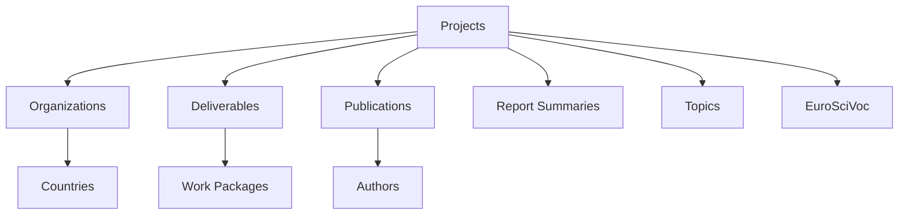

# CORDIS Data Structure Guide

## Overview
Complete CORDIS data repository structure for Horizon Europe research analysis.

## Data Categories & File Locations

### 1. Projects Dataset
**Location**: `/horizon/projects/`
- **File**: `cordis-HORIZONprojects-json.zip`
- **Contents**:
  - `project.json` - Core project information
  - `organization.json` - Participating organizations
  - `euroSciVoc.json` - Scientific classifications
  - `topics.json` - Call topics and themes
  - `webLink.json` - Project websites
  - `legalBasis.json` - Legal frameworks
  - `policyPriorities.json` - EU policy alignments

**Key Fields**:
```json
{
  "rcn": "Record Control Number",
  "id": "Grant Agreement ID",
  "acronym": "Project Acronym",
  "status": "Project Status",
  "startDate": "YYYY-MM-DD",
  "endDate": "YYYY-MM-DD",
  "totalCost": "EUR amount",
  "ecMaxContribution": "EU funding",
  "coordinator": "Organization ID",
  "participants": ["Org IDs"],
  "countries": ["ISO codes"]
}
```

### 2. Project Deliverables
**Location**: `/horizon/deliverables/`
- **File**: `cordis-HORIZONdeliverables-json.zip`
- **Contents**:
  - `deliverable.json` - Deliverable details
  - `deliverable_project_link.json` - Project associations

**Key Fields**:
```json
{
  "deliverableId": "Unique ID",
  "projectId": "Parent project GA",
  "title": "Deliverable title",
  "description": "Abstract",
  "deliveryDate": "YYYY-MM-DD",
  "nature": "Report/Software/Data/Other",
  "disseminationLevel": "Public/Confidential",
  "workPackage": "WP number"
}
```

### 3. Publications
**Location**: `/horizon/publications/`
- **File**: `cordis-HORIZONpublications-json.zip`
- **Contents**:
  - `publication.json` - Publication metadata
  - `publication_project_link.json` - Project associations
  - `publication_authors.json` - Author information

**Key Fields**:
```json
{
  "publicationId": "Unique ID",
  "projectId": "Associated project",
  "doi": "Digital Object Identifier",
  "title": "Publication title",
  "authors": ["Author names"],
  "journal": "Journal name",
  "year": "Publication year",
  "openAccess": true/false,
  "citations": "Citation count"
}
```

### 4. Report Summaries
**Location**: `/horizon/report_summaries/`
- **File**: `cordis-HORIZONreports-json.zip`
- **Contents**:
  - `periodic_report.json` - Periodic reports
  - `final_report.json` - Final reports
  - `report_summary.json` - Public summaries

**Key Fields**:
```json
{
  "reportId": "Unique ID",
  "projectId": "Project GA",
  "reportingPeriod": "1/2/3/Final",
  "submissionDate": "YYYY-MM-DD",
  "summary": "Public summary text",
  "achievements": ["Key achievements"],
  "exploitableResults": ["Results"],
  "impactAssessment": "Impact description"
}
```

## Relationships Between Datasets



## Data Processing Pipeline

### 1. Extraction
```python
import zipfile
import json
from pathlib import Path

base_path = Path("C:/Projects/OSINT - Foresight/data/raw/source=cordis/horizon")

datasets = [
    "projects/cordis-HORIZONprojects-json.zip",
    "deliverables/cordis-HORIZONdeliverables-json.zip",
    "publications/cordis-HORIZONpublications-json.zip",
    "report_summaries/cordis-HORIZONreports-json.zip"
]

for dataset in datasets:
    zip_path = base_path / dataset
    if zip_path.exists():
        extract_to = zip_path.parent
        with zipfile.ZipFile(zip_path, 'r') as zip_ref:
            zip_ref.extractall(extract_to)
```

### 2. Loading & Validation
```python
def load_cordis_data(category):
    """Load and validate CORDIS JSON data"""
    data_path = base_path / category

    # Find all JSON files
    json_files = list(data_path.glob("*.json"))

    data = {}
    for json_file in json_files:
        with open(json_file, 'r', encoding='utf-8') as f:
            key = json_file.stem
            data[key] = json.load(f)

    return data
```

### 3. Slovakia-Specific Filtering
```python
def filter_slovakia_projects(projects, organizations):
    """Filter projects with Slovak participation"""
    sk_projects = []

    for project in projects:
        # Check if Slovakia in countries
        if 'SK' in project.get('countries', []):
            sk_projects.append(project)
            continue

        # Check participant organizations
        for org_id in project.get('participants', []):
            org = organizations.get(org_id)
            if org and org.get('country') == 'SK':
                sk_projects.append(project)
                break

    return sk_projects
```

## File Naming Convention

```
/horizon/
  /projects/
    cordis-HORIZONprojects-json.zip     # Original download
    project.json                         # Extracted data
    organization.json
    ...
  /deliverables/
    cordis-HORIZONdeliverables-json.zip
    deliverable.json
    ...
  /publications/
    cordis-HORIZONpublications-json.zip
    publication.json
    ...
  /report_summaries/
    cordis-HORIZONreports-json.zip
    periodic_report.json
    final_report.json
    ...
```

## Analysis Capabilities

With all four datasets, we can:

1. **Project Analysis**
   - Total EU funding to Slovak entities
   - Technology domains (via EuroSciVoc)
   - Collaboration networks
   - Timeline of participation

2. **Output Analysis**
   - Publications per project
   - Open access compliance
   - Deliverable completion rates
   - Citation impact

3. **Impact Assessment**
   - Exploitable results
   - Technology readiness levels
   - Policy influence
   - Economic impact

4. **Network Analysis**
   - Key Slovak institutions
   - International partnerships
   - Consortium compositions
   - Geographic distribution

## Data Quality Checks

- [ ] Projects have valid grant agreement IDs
- [ ] Dates are in ISO format (YYYY-MM-DD)
- [ ] Organization IDs are consistent across files
- [ ] Country codes are ISO 3166-1 alpha-2
- [ ] Financial amounts are numeric
- [ ] DOIs are valid format
- [ ] All accessed_date fields populated

## Citation Template

```
European Commission. (2025). CORDIS - EU research projects under Horizon Europe:
[Projects/Deliverables/Publications/Reports]. Retrieved 2025-09-14, from
https://cordis.europa.eu/data/cordis-HORIZON[type]-json.zip
```

---
*Created: 2025-09-14*
*Version: 1.0*
