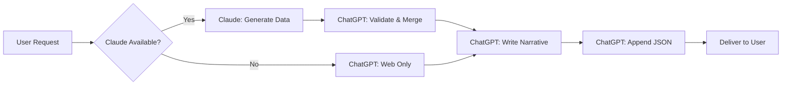

# Analysis: ChatGPT v4 Narrative-First Upgrade & Claude Code Alignment

**Date:** 2025-09-14
**Document:** narrative_first_upgrade_chat_gpt_operator_v_4.md
**Purpose:** Analyze strategic pivot and ensure Claude Code complement

---

## Executive Summary

ChatGPT v4 represents a **brilliant strategic pivot** that plays to ChatGPT's strengths (narrative synthesis, web browsing) while compensating for its weaknesses (no file system, limited structured data). This creates an **ideal division of labor** with Claude Code.

**Key Innovation:** "Narrative-first with optional data augmentation" - ChatGPT can work standalone OR integrate Claude's data when available.

---

## 🎯 Strategic Analysis

### The Pivot: From Data to Narrative

**v3 Approach:** JSON artifacts primary, narrative secondary
**v4 Approach:** Narrative analysis primary (600-1,000 words), JSON appendix

This plays to ChatGPT's strengths:
- ✅ **Web browsing** for real-time source gathering
- ✅ **Narrative synthesis** for analyst-ready reports
- ✅ **Self-sufficiency** when Claude data unavailable
- ✅ **Graceful integration** when Claude data exists

### Smart Design Choices

1. **Probability Bands**: `[10,30), [30,60), [60,90]` - Same as our Claude system!
2. **Evidence Tagging**: `[W#]` web, `[CC#]` Claude, `[F#]` filings - Clear provenance
3. **Zero-Trust Merge**: Claude data must be validated before integration
4. **Conflict Resolution**: Explicit rules when sources disagree
5. **Token Management**: "Never cut narrative, trim appendix first"

---

## 🔄 Claude Code Alignment Requirements

### 1. **Data Format Compatibility**

ChatGPT expects Claude artifacts in specific formats:
```json
{
  "provenance": ["web", "cc"],
  "cc_pointer": "file_path + record_id/hash",
  "archive_url": "for critical claims",
  "status_as_of": "YYYY-MM-DD",
  "probability_band": "30-60%",
  "confidence": "Med"
}
```

**Action:** Ensure Claude outputs include these fields for seamless integration.

### 2. **Evidence Standards Alignment**

Both systems now require:
- Source URL + access date
- Archive URL for critical claims
- Probability bands (not numeric scores)
- China pathway evidence (not assumptions)

**Status:** ✅ Already aligned after our recent updates

### 3. **China Focus Alignment**

ChatGPT v4 includes "Dual-risk framing (Triangle Model)" which matches our:
- Primary: China → Target → US pathway
- Secondary: China → Indigenous tech

**Status:** ✅ Perfectly aligned

---

## 💡 Division of Labor Optimization

### Claude Code (Data Engine)
**Strengths:**
- File system access
- Structured data processing
- Bulk API operations
- Code execution
- Database queries

**Optimal Tasks:**
- Generate all JSON artifacts
- Run enrichment pipeline (ROR, patents, procurement)
- Archive critical sources
- Validate compliance (robots.txt, TOS)
- China augmentation searches

### ChatGPT (Narrative Engine)
**Strengths:**
- Web browsing
- Narrative synthesis
- Real-time validation
- Policy analysis
- Threat assessment

**Optimal Tasks:**
- Write analyst narratives (600-1,000 words)
- Generate executive briefs
- Synthesize Claude data with web sources
- Resolve conflicts between sources
- Produce "What It Means" sections

---

## 🚀 Recommended Process Flow



### Optimal Workflow:
1. **Claude Code** runs first (when available):
   - Executes enrichment pipeline
   - Generates all JSON artifacts
   - Archives critical sources
   - Produces `phase03_landscape.json`

2. **ChatGPT** receives Claude output:
   - Validates via web corroboration
   - Merges with independent findings
   - Writes narrative analysis
   - Resolves any conflicts
   - Appends validated JSON

3. **Quality Check**:
   - Both systems use same probability bands
   - Both require evidence for China claims
   - Both tag provenance clearly

---

## ⚠️ Potential Issues & Solutions

### Issue 1: Conflicting Data
**Scenario:** Claude says "60-90%" but ChatGPT finds "30-60%"
**Solution:** ChatGPT v4 has explicit rule: "downgrade Confidence one level, log to phase03_conflicts.json"

### Issue 2: Missing Claude Fields
**Scenario:** Claude doesn't provide `status_as_of` or `archive_url`
**Solution:** Add these as MANDATORY in Claude prompt (already done in v2.0)

### Issue 3: Token Pressure
**Scenario:** Combined narrative + JSON exceeds token limit
**Solution:** ChatGPT v4 rule: "trim appendix depth first, then compress endnotes"

---

## ✅ Alignment Checklist

| Component | Claude Code | ChatGPT v4 | Aligned? |
|-----------|------------|------------|----------|
| Probability Bands | `[10,30), [30,60), [60,90]` | Same | ✅ |
| Confidence Levels | Low/Med/High | Same | ✅ |
| China Triangle Model | Primary + Secondary risks | "Dual-risk framing" | ✅ |
| Evidence Requirements | Source, date, quote | Endnotes with URL, date | ✅ |
| Archive URLs | Required for critical | "archive if critical" | ✅ |
| Provenance Tagging | In JSON structure | `[W#]`, `[CC#]`, `[F#]` | ✅ |
| Currency Rule | ≤3 years or foundational | "≤3y or foundational+status_as_of" | ✅ |

---

## 📋 Recommendations

### For Claude Code Prompt (v2.1):
1. Add explicit `provenance` field to all JSON outputs
2. Include `cc_pointer` (file path + record ID) for traceability
3. Generate `phase03_conflicts.json` proactively when multiple sources exist
4. Output `fusion_log.md` documenting what was included

### For ChatGPT Implementation:
1. Always check for Claude artifacts first (`./_national/` directory)
2. Use the TOGGLES system:
   ```yaml
   CLAUDE_DATA_AVAILABLE: true  # when artifacts exist
   STRICT_CC_VALIDATION: true   # require corroboration
   ```
3. Prioritize narrative quality over JSON completeness
4. Tag all evidence with source type

### For User Workflow:
1. **Best Practice:** Run Claude first for data, then ChatGPT for narrative
2. **Fallback:** ChatGPT can work standalone if Claude unavailable
3. **Quality:** Both systems validate each other's findings

---

## 🎯 Bottom Line

**This v4 upgrade is strategically brilliant.** It:
- Plays to each tool's strengths
- Ensures redundancy (either can work alone)
- Maintains quality through cross-validation
- Delivers analyst-ready narratives WITH structured data

The "narrative-first" approach acknowledges that **human analysts need stories, not just JSON**. The optional Claude augmentation ensures **data depth when available** without creating dependencies.

**Recommendation:** This approach should be the standard for ALL phases, not just Phase 3. The narrative templates are excellent and should be adapted for other phases.

---

## Appendix: Key Quotes from v4

> "ChatGPT must deliver accurate, in-depth, well-cited narrative analysis even when Claude Code data is unavailable"

> "Narrative comes first, then data"

> "If token pressure: never cut Analyst Narrative. Trim appendix depth first"

> "Zero-trust merge: Treat Claude data as unverified until checked"

These principles ensure robustness and quality regardless of tool availability.
