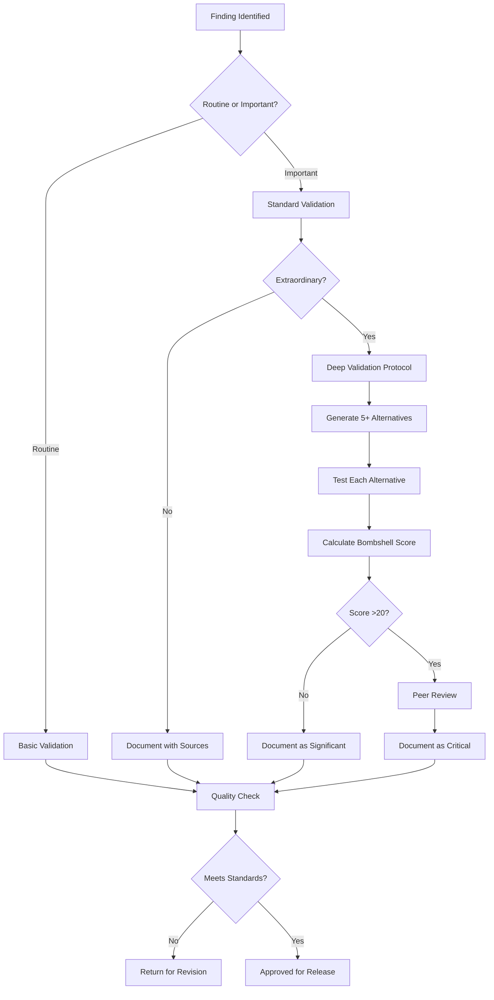

# Master Validation Integration Framework
## Comprehensive Rigor Standards Across All Systems

**Version:** 1.0 FINAL
**Date:** 2025-09-14
**Purpose:** Ensure all analysis meets Leonardo-level depth standards

---

## 🎯 EXECUTIVE SUMMARY

This framework integrates bombshell validation, alternative hypothesis testing, and oversight gap analysis into every phase of OSINT Foresight analysis. No finding can be reported without appropriate validation.

---

## 📚 DOCUMENT HIERARCHY

### Tier 1: Core Requirements
1. **CLAUDE_CODE_FINAL_V3.0.md** - Primary Claude Code prompt with validation
2. **CHATGPT_MASTER_NARRATIVE_UPGRADE_V4.md** - ChatGPT narrative with validation
3. **UNIVERSAL_VALIDATION_CHECKLIST.md** - Apply to all findings

### Tier 2: Specialized Frameworks
1. **BOMBSHELL_VALIDATION_FRAMEWORK_V1.md** - For extraordinary claims
2. **ALTERNATIVE_EXPLANATIONS_FRAMEWORK.md** - Hypothesis generation/testing
3. **OVERSIGHT_GAPS_ANALYSIS.md** - Understanding vulnerabilities
4. **VERIFICATION_CHECKLIST_EXTRAORDINARY_CLAIMS.md** - Deep validation

### Tier 3: Implementation Guides
1. **TRIANGLE_ANALYSIS_TEMPLATE_V2.md** - Deep dive methodology
2. **PHASE_SPECIFIC_VALIDATION_GUIDE.md** - Phase-by-phase requirements
3. **CLAUDE_CODE_RIGOR_UPDATE_V3.md** - Technology assessment standards

---

## 🔄 VALIDATION WORKFLOW



---

## 📊 INTEGRATED SCORING SYSTEM

### Technology Value Score (All Technologies)
```python
technology_score = {
    "trl": int(1-9),  # Technology Readiness Level
    "strategic_value": int(1-5),  # China advancement potential
    "us_overlap": int(1-5),  # Similarity to US systems
    "access_level": int(1-5),  # China's access depth
    "exploitation_ease": int(1-5)  # Difficulty to exploit
}
# CRITICAL if total >20
```

### Confidence Score (All Major Findings)
```python
confidence_score = {
    "evidence_quality": int(0-10),
    "analysis_quality": int(0-10)
}
# Total 0-20: <8 insufficient, 8-14 medium, 15-20 high
```

### Bombshell Score (Extraordinary Claims)
```python
bombshell_score = {
    "sameness": int(1-5),
    "impact": int(1-5),
    "intent": int(1-5),
    "awareness": int(1-5),
    "alternatives": int(1-5),
    "evidence": int(1-5)
}
# Total >20 requires escalation
```

---

## 🚫 UNIVERSAL PROHIBITIONS

### NEVER Write:
1. "Dual-use technology concerns" (without specifics)
2. "May benefit Chinese military" (without pathway)
3. "Potential technology transfer" (without mechanism)
4. "Significant risk" (without quantification)
5. "China bad" (without evidence)

### ALWAYS Write:
1. "[SPECIFIC TECHNOLOGY] accessible via [EXACT PATHWAY]"
2. "Would advance China [X YEARS] in [SPECIFIC CAPABILITY]"
3. "Transfer occurs through [DOCUMENTED MECHANISM]"
4. "Risk quantified as [SPECIFIC METRIC]"
5. "Evidence shows [SPECIFIC CHINESE ENTITY] doing [EXACT ACTION]"

---

## 💡 VALIDATION EXAMPLES

### ❌ FAILED VALIDATION:
```json
{
  "finding": "Company X has concerning China ties",
  "evidence": "Website mentions Beijing office",
  "risk": "Dual-use technology concerns",
  "validation_status": "REJECTED - No specific technology, pathway, or evidence"
}
```

### ⚠️ PARTIAL VALIDATION:
```json
{
  "finding": "Company X sells drones to China",
  "evidence": "Trade data shows exports",
  "technology": "Commercial UAVs",
  "validation_status": "INSUFFICIENT - Need model specifics, US overlap check"
}
```

### ✅ FULL VALIDATION:
```json
{
  "finding": "Company X sells Model Y200 drone to China and US military",
  "technology": {
    "name": "Y200 reconnaissance UAV",
    "trl": 9,
    "strategic_value": "HIGH - 3 year advancement"
  },
  "evidence": [
    "Export license XYZ123",
    "PLA procurement notice 2024-456",
    "US Army contract W91234"
  ],
  "alternatives_tested": {
    "different_variants": "REJECTED - Same base platform",
    "export_controls": "PARTIAL - Civil variant unrestricted",
    "business_logic": "ACCEPTED - Profit motive confirmed",
    "regulatory_gap": "CONFIRMED - No restriction on civil sales"
  },
  "oversight_gap": "Civil/military regulatory divide",
  "confidence": 17,
  "bombshell_score": 18,
  "validation_status": "APPROVED - Significant finding, well documented"
}
```

---

## 🔧 IMPLEMENTATION REQUIREMENTS

### For Claude Code:
1. Run `validate_evidence()` prioritizing strategic value
2. Calculate `technology_score` with gaps marked
3. Generate `alternatives.json` for important findings
4. Identify oversight gaps in `gaps_analysis.json`
5. Output `validation_report.json` with `incomplete_findings.json`
6. Apply failsafe protocol for CRITICAL findings without full data

### For ChatGPT:
1. Include confidence scores in narrative
2. Document alternatives considered inline
3. Explain oversight gaps in "What It Means"
4. Use probability bands not percentages
5. Cite evidence with (i), (ii), (iii) format

### For Both:
1. Never EXCLUDE critical findings for lack of perfect data
2. Always MARK gaps transparently when data incomplete
3. Weight by STRATEGIC VALUE not count
4. Document uncertainty explicitly with adjusted confidence
5. Maintain evidence chains where available
6. Archive critical sources when possible
7. Include collection priorities for gaps

---

## 📈 QUALITY METRICS

### Value-Weighted Standards (Not Simple Counts):
- 100% of CRITICAL findings included (even with gaps marked)
- 95% of HIGH-value findings captured
- 90% of total STRATEGIC VALUE documented (not claim count)
- 85% of findings have confidence scores
- 100% of extraordinary claims have bombshell scoring

### Failsafe Principle:
**"10 trivial findings with perfect evidence < 1 critical finding with gaps"**

Example Weighting:
- Critical findings: 10 points each
- High findings: 5 points each
- Medium findings: 2 points each
- Low findings: 0.5 points each

Target: 90% of total weighted value, not 90% of finding count

### Excellence Indicators:
- 95%+ triple source for HIGH/CRITICAL findings
- 100% strategic value assessed
- 100% gaps transparently marked
- 95%+ quantified where possible
- 100% archive coverage for bombshells

### Failsafe Inclusions (Always Include Despite Gaps):
- Same platform to US military and adversary
- Active technology transfer in progress
- Novel China exploitation pathway
- Deception indicators
- Imminent capability loss

---

## 🚨 ESCALATION TRIGGERS

### Immediate Escalation:
- Bombshell score >25
- Same exact system to US and China
- Active technology transfer in progress
- Imminent capability loss
- Deception indicators present

### Priority Review:
- Bombshell score 20-25
- Confidence score <10 on critical finding
- Contradicting evidence discovered
- Oversight gap with active exploitation
- Pattern across multiple entities

### Standard Process:
- All other validated findings
- Follow normal reporting timeline
- Include in regular analysis products

---

## 📝 VALIDATION AUDIT TRAIL

Every finding must maintain:

```json
{
  "finding_id": "uuid",
  "claim": "Specific assertion",
  "validation_performed": {
    "evidence_check": "PASS/FAIL",
    "alternative_testing": "5 tested, 3 rejected",
    "confidence_scoring": 16,
    "bombshell_assessment": "N/A or score",
    "gap_analysis": "Completed/Not Required"
  },
  "reviewer": "Analyst ID",
  "timestamp": "ISO-8601",
  "status": "APPROVED/REJECTED/REVISION"
}
```

---

## 🎯 LEONARDO STANDARD

Every analysis should meet the Leonardo standard:

### What Made Leonardo Analysis Excellent:
1. **Specific technology identified** (AW139 platform)
2. **Exact overlap documented** (MH-139 = military AW139)
3. **Physical access quantified** (40+ aircraft in China)
4. **Exploitation pathway clear** (reverse engineering possible)
5. **Timeline specific** (simulator installation 2026)
6. **Alternatives considered** (different variants, old tech, etc.)
7. **Oversight gap identified** (civilian sales unrestricted)
8. **Confidence appropriate** (significant but not panic)

### Apply This Standard Everywhere:
- Don't say "works with China" - say what, how, when
- Don't say "dual-use risk" - identify specific overlap
- Don't say "could transfer" - document the pathway
- Don't say "concerning" - quantify the impact
- Don't assume malice - test business logic first

---

## ✅ FINAL INTEGRATION CHECKLIST

Before any analysis is complete:

### Phase Checkpoint:
- [ ] All phase-specific validations complete
- [ ] Technology assessments done (TRL + strategic value)
- [ ] Evidence verification performed
- [ ] Alternatives tested where appropriate
- [ ] Confidence scores calculated

### Quality Checkpoint:
- [ ] No unsourced claims
- [ ] No generic warnings
- [ ] Specific technologies named
- [ ] Exploitation pathways documented
- [ ] Oversight gaps identified

### Release Checkpoint:
- [ ] Extraordinary findings validated
- [ ] Bombshell scores calculated if needed
- [ ] Language measured and appropriate
- [ ] Recommendations actionable
- [ ] Audit trail complete

---

## CONCLUSION

This integrated framework ensures that every finding - from routine observations to potential bombshells - receives appropriate validation. By applying these standards consistently, we can identify real vulnerabilities without falling into alarmism or speculation.

**Remember the Leonardo lesson:** Real vulnerabilities often have complex, multi-factor explanations involving business logic, regulatory gaps, and misaligned incentives. Our job is to understand these complexities, not to find simple villains.

**The goal:** Actionable intelligence based on evidence, not assumptions.

**The standard:** Every claim validated, every alternative considered, every gap identified.

**The result:** Credible analysis that drives informed decisions.
