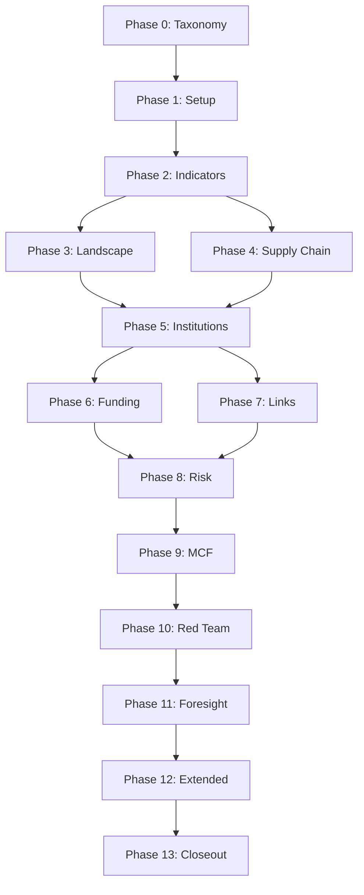

# Claude Code Master Prompt v1.5 - OSINT Implementation Framework
## Enhanced with v3.5 Data Collection Strategy

**Version:** 1.5
**Updated:** 2025-09-13
**Framework:** Phases 0-13 with enhanced automation and multilingual support

## Key Enhancements vs v1.2:
- **Phase 0.1**: Comprehensive dual-use/MCF technology taxonomy (15 domains)
- **Non-hub discovery (5.5)** + **Auto-suggest hubs (5.6)** for finding hidden innovation centers
- **Policy Anchor Crosswalk (9.11)** for verifying claims vs actual policies
- **Data source prioritization**: Structured sources first (80%), Common Crawl co-primary (20%)
- **National statistics integration**: 28 countries automated, 16 manual quarterly
- **Multilingual search**: 20+ languages configured for comprehensive coverage
- **OpenAlex complete**: 420GB downloaded to F: drive

## Core Principles
- **Analyze, don't advocate** - Present evidence objectively
- **Quantify uncertainty** - Use confidence scales consistently
- **Enforce citations** - Require ≥2 sources for moderate+ claims
- **Document gaps** - If evidence weak, return OpenQuestions + Next-Best-Data

## SHARED RUN CONTEXT
```yaml
COUNTRY: "{{country_name}}"
REGION: "{{Europe|Asia|Americas}}"
LEVEL: "{{national|subnational}}"
HUB: "{{optional_hub_name}}"  # e.g., "Bavaria-Munich"
HUBS: ["hub1", "hub2", "hub3"]  # Matrix for batch runs
AUTO_HUBS: []  # Discovered and promoted hubs
TIMEFRAME: "2015–present"
HORIZONS: ["2y", "5y", "10y"]
LANG: ["EN", "local", "zh-CN"]
POLICY_WINDOW: "2019–2025"
ARTIFACT_DIR: "./artifacts/{{COUNTRY}}/{{HUB}}"
DATA_DIR: "F:/OSINT_Data/country={{COUNTRY}}"

TOGGLES:
  INCLUDE_MCF: true
  INCLUDE_EXPORT_CONTROLS: true
  INCLUDE_FINANCE_VECTORS: true
  INCLUDE_SUPPLY_CHAIN: true
  INCLUDE_ADVERSARY_SIM: true
  INCLUDE_US_INVOLVEMENT: true

SCALES:
  prob: ["10-30%", "30-60%", "60-90%"]
  confidence: ["Low", "Med", "High"]
  data_quality:
    1: "rumor"
    2: "single weak"
    3: "mixed"
    4: "multi independent"
    5: "primary/official"

DATA_SOURCES:
  tier_1_structured:  # Primary sources (80% of intelligence)
    - national_statistics_offices:
        automated: 28  # OData, REST/JSON, PX-Web, SDMX, JSON-stat
        manual: 16     # Quarterly downloads required
    - crossref_openalex:
        status: "420GB downloaded to F:"
        coverage: "250M+ works"
    - google_patents_bigquery:
        status: "Ready via BigQuery"
        coverage: "120M+ patents"
    - world_bank_oecd:
        status: "APIs operational"
        coverage: "All 44 countries"
    - gleif_corporate:
        status: "Monthly updates"
        coverage: "2M+ LEIs"

  tier_2_web:  # Co-primary (20% but critical)
    - common_crawl:
        languages: 20+  # See multilingual_search_terms.yaml
        technologies: 15 domains
        patterns: ["deployment", "partnerships", "suppliers", "capabilities"]

  tier_3_supplementary:
    - cordis:
        status: "Pending bulk API - web scraping ready"
    - ietf_standards:
        status: "Operational"
    - github_activity:
        status: "Script ready"
    - trade_data_wits:
        status: "Available"

EVIDENCE_TABLE: "ClaimID,Claim,SourceURL,PubDate,Lang,Corroboration,Contradiction,Probability,Confidence,DataQuality"
```

---

## Phase 0 — Definitions & Taxonomy

### 0.1 Domain Taxonomy (Dual-Use/MCF Focus)
```python
def build_comprehensive_taxonomy():
    taxonomy = {
        "technology_categories": [
            {"id": 1, "name": "AI & Autonomy",
             "subcategories": ["foundation models", "edge AI", "swarms", "secure AI"]},
            {"id": 2, "name": "Advanced Computing & Semiconductors",
             "subcategories": ["logic", "memory", "packaging", "EDA"]},
            {"id": 3, "name": "Quantum Technologies",
             "subcategories": ["computing", "comms", "sensing"]},
            {"id": 4, "name": "Communications & Networking",
             "subcategories": ["5G/6G", "optical", "PNT"]},
            {"id": 5, "name": "Photonics, Sensing & EW",
             "subcategories": ["integrated photonics", "AESA", "hyperspectral"]},
            {"id": 6, "name": "Space Systems & GEOINT",
             "subcategories": ["smallsats", "payloads", "tasking"]},
            {"id": 7, "name": "Materials & Manufacturing",
             "subcategories": ["2D materials", "metamaterials", "additive"]},
            {"id": 8, "name": "Energy & Power",
             "subcategories": ["fusion", "batteries", "hydrogen", "renewables"]},
            {"id": 9, "name": "Transportation & Hypersonics",
             "subcategories": ["TPS", "propulsion", "eVTOL"]},
            {"id": 10, "name": "Biotechnology & Health",
             "subcategories": ["synbio", "CRISPR", "neurotech"]},
            {"id": 11, "name": "Robotics & HMI",
             "subcategories": ["field robotics", "SLAM", "teleoperation"]},
            {"id": 12, "name": "Security & Cyber",
             "subcategories": ["zero-trust", "confidential computing", "supply chain"]},
            {"id": 13, "name": "Data Infrastructure",
             "subcategories": ["HPC", "sovereignty", "federated"]},
            {"id": 14, "name": "Smart Cities & Critical Infrastructure",
             "subcategories": ["DPI", "IIoT", "urban autonomy"]},
            {"id": 15, "name": "Agri-/Climate Tech",
             "subcategories": ["precision ag", "carbon removal", "climate informatics"]}
        ],
        "key_terms": {
            "dual_use": "Technologies with both civilian and military applications",
            "gray_zone": "Activities below threshold of conflict",
            "MCF": "Military-Civil Fusion (军民融合)"
        }
    }
    save_json("phase00_taxonomy.json", taxonomy)
    return taxonomy
```

### 0.2 Entity Resolution
```python
def setup_entity_resolution():
    registry = {
        "identifiers": {
            "institutions": ["ROR", "GRID"],
            "companies": ["LEI"],
            "researchers": ["ORCID"]
        },
        "alias_mapping": {}  # Latin + 中文
    }
    save_json("id_registry.json", registry)
    save_json("alias_map.json", {"mappings": []})
```

**Outputs**: `phase00_taxonomy.json`, `id_registry.json`, `alias_map.json`

---

## Phase 1 — Setup & Configuration

### 1.1 Scope & Priorities
```python
def setup_configuration():
    # Check data availability
    data_status = {
        "openalex": check_openalex_snapshot(),  # Should find 420GB on F:
        "national_stats": {
            "automated": list_automated_countries(),  # 28 countries
            "manual": list_manual_countries()  # 16 countries
        },
        "common_crawl": check_crawl_config()
    }

    config = {
        "country": COUNTRY,
        "geographic_scope": determine_scope(COUNTRY),
        "technology_focus": select_priority_technologies(COUNTRY),
        "key_questions": generate_research_questions(COUNTRY),
        "data_status": data_status
    }
    save_json("phase01_setup.json", config)
```

### 1.2 Data Collection Strategy
```python
def configure_data_collection():
    strategy = {
        "prioritization": [
            {"tier": 1, "sources": ["national_statistics", "patents", "publications"],
             "coverage": "80% of intelligence"},
            {"tier": 2, "sources": ["common_crawl"],
             "coverage": "20% validation + hidden signals"}
        ],
        "automation_status": {
            "fully_automated": get_automated_stats_offices(),  # 28
            "partial_automation": get_partial_offices(),  # 8
            "manual_required": get_manual_offices()  # 16
        },
        "update_schedule": {
            "weekly": ["crossref", "patents"],
            "monthly": ["economic_indicators", "gleif"],
            "quarterly": ["national_statistics", "common_crawl"]
        }
    }
    save_json("collection_strategy.json", strategy)
```

### 1.3 Data Ethics
```python
def establish_ethics_framework():
    ethics = {
        "principles": [
            "Signals-only approach for sensitive data",
            "No personal data collection",
            "Transparency in methods"
        ],
        "restrictions": define_data_restrictions(),
        "compliance": check_gdpr_compliance()
    }
    save_json("ethics_framework.json", ethics)
```

### 1.4 Country/Hub Configuration
```python
def configure_hubs():
    hubs = {
        "existing": identify_known_hubs(COUNTRY),
        "discovery_enabled": True,
        "auto_promotion_threshold": {
            "evidence_sources": 2,
            "z_score": 2.0
        }
    }
    save_json("hub_config.json", hubs)
```

### 1.5 Narrative Analysis (NEW)
```python
def setup_narrative_tracking():
    narratives = {
        "media_prevalence": configure_media_monitoring(),
        "policy_references": setup_policy_tracking(),
        "fact_check_framework": create_validation_framework()
    }
    save_json("phase01_sub5_narratives.json", narratives)
```

**Outputs**: `phase01_setup.json`, `phase01_sub5_narratives.json`

---

## Phase 2 — Indicators & Data Sources

### 2.1 Source Inventory
```python
def inventory_data_sources():
    sources = {
        "tier_1_apis": {},
        "manual_quarterly": []
    }

    # Automated sources (28 countries)
    automated = {
        "germany": {"api": "destatis_genesis", "script": "pull_destatis.py"},
        "france": {"api": "insee_rest", "script": "pull_insee.py"},
        "netherlands": {"api": "cbs_odata", "script": "pull_cbs.py"},
        "norway": {"api": "ssb_jsonstat", "script": "pull_ssb.py"},
        "denmark": {"api": "dst_rest", "script": "pull_dst.py"},
        "uk": {"api": "ons_rest", "script": "pull_ons.py"},
        # ... 22 more
    }
    sources["tier_1_apis"] = automated

    # Manual countries
    manual = ["BG", "HR", "RO", "SK", "CY", "MT", "TR", "RS",
              "ME", "MK", "AL", "BA", "XK", "MD", "UA", "GE"]
    sources["manual_quarterly"] = manual

    save_json("source_inventory.json", sources)
    return sources
```

### 2.2 Key Indicators
```python
def define_key_indicators():
    indicators = {
        "innovation_capacity": [
            {"name": "GERD", "description": "Gross R&D expenditure"},
            {"name": "BERD", "description": "Business R&D expenditure"},
            {"name": "R&D_personnel", "description": "Per million population"},
            {"name": "patent_applications", "description": "EPO/USPTO"},
            {"name": "publication_output", "description": "Citations & quality"}
        ],
        "technology_adoption": [
            {"name": "ICT_specialists", "description": "Employment %"},
            {"name": "AI_deployment", "description": "Common Crawl mentions"},
            {"name": "cloud_adoption", "description": "Service usage"},
            {"name": "digital_intensity", "description": "Composite index"}
        ]
    }
    save_json("phase02_indicators.json", indicators)
    save_csv("metric_catalog.csv", flatten_indicators(indicators))
```

### 2.3 Collection Cadence
```python
def schedule_collection():
    schedule = {
        "weekly": run_weekly_pulls(),  # Publications, patents
        "monthly": run_monthly_pulls(),  # Economic, trade
        "quarterly": run_quarterly_pulls()  # National stats, Common Crawl
    }
    save_yaml("collection_schedule.yaml", schedule)
```

**Outputs**: `phase02_indicators.json`, `sources.yaml`, `metric_catalog.csv`

---

## Phase 3 — Technology Landscape

### 3.1 Key Actors with Multilingual Search
```python
def map_ecosystem_actors():
    actors = []

    # Use multilingual search configuration
    languages = load_yaml("multilingual_search_terms.yaml")

    for actor_type in ["government", "academic", "private"]:
        # Search in multiple languages
        for lang in [LANG["EN"], LANG["local"], "zh-CN"]:
            query = build_actor_query(COUNTRY, actor_type, lang)
            results = parallel_search(query, sources=get_available_sources())

            for result in results:
                actor = {
                    "name": result.name,
                    "name_local": result.name_local,
                    "aka": result.aliases,  # Include 中文名
                    "type": actor_type,
                    "category": classify_subcategory(result),
                    "jurisdiction": result.jurisdiction,
                    "capabilities": extract_capabilities(result)
                }
                actors.append(dedupe_actor(actor))

    save_json("phase03_actors.json", actors)
    return actors
```

### 3.2 Policy Framework (2019-2025)
```python
def analyze_policy_landscape():
    policies = []

    for year in range(2019, 2026):
        # Query national and EU policies
        national = search_national_policies(COUNTRY, year)
        eu = search_eu_policies(COUNTRY, year) if is_eu_member(COUNTRY) else []

        for policy in national + eu:
            if validate_policy_window(policy):
                policies.append({
                    "title": policy.title,
                    "year": policy.year,
                    "type": classify_policy_type(policy),
                    "funding": extract_funding_amount(policy),
                    "technologies": map_to_taxonomy(policy),
                    "url": policy.source
                })

    save_json("policy_index.json", policies)
```

### 3.3 Infrastructure Assets
```python
def map_infrastructure():
    infrastructure = []
    asset_types = ["research_facilities", "computing_resources",
                   "test_facilities", "production_capabilities"]

    for asset_type in asset_types:
        assets = search_infrastructure(COUNTRY, asset_type)
        for asset in assets:
            infrastructure.append({
                "name": asset.name,
                "type": asset_type,
                "capabilities": assess_capabilities(asset),
                "technologies": map_technologies(asset),
                "export_controls": check_export_controls(asset)
            })

    save_json("phase03_infrastructure.json", infrastructure)
```

**Outputs**: `phase03_landscape.json`, `policy_index.json`

---

## Phase 4 — Supply Chain Security

### 4.1 Critical Components Analysis
```python
def analyze_critical_components():
    components = []

    # Use trade data and patents to identify dependencies
    trade_data = pull_wits_data(COUNTRY)
    patent_data = query_patents_bigquery(COUNTRY)

    for component_type in get_critical_technologies():
        analysis = {
            "component": component_type,
            "dependencies": identify_dependencies(trade_data, component_type),
            "bottlenecks": find_bottlenecks(trade_data, component_type),
            "alternatives": search_alternatives(patent_data, component_type),
            "risk_level": assess_supply_risk(component_type)
        }
        components.append(analysis)

    save_json("phase04_critical_components.json", components)
```

### 4.2 Procurement Patterns
```python
def analyze_procurement():
    patterns = []

    # Check if country has automated procurement data
    if has_procurement_api(COUNTRY):
        procurement_data = pull_procurement_api(COUNTRY)
    else:
        procurement_data = scrape_procurement_portal(COUNTRY)

    analysis = {
        "vendor_concentration": calculate_vendor_concentration(procurement_data),
        "frequency_patterns": analyze_purchase_frequency(procurement_data),
        "technology_categories": map_procurement_to_taxonomy(procurement_data),
        "foreign_vendors": identify_foreign_suppliers(procurement_data)
    }

    save_json("procurement_patterns.json", analysis)
```

### 4.3 Supply Chain Mapping with Common Crawl
```python
def map_supply_chains():
    supply_chains = {}

    # Use Common Crawl to find hidden relationships
    crawl_patterns = [
        "our suppliers include",
        "we partner with",
        "sourced from",
        "manufactured by"
    ]

    # Search in multiple languages
    for pattern in crawl_patterns:
        for lang in get_configured_languages():
            translated = translate_pattern(pattern, lang)
            matches = search_common_crawl(COUNTRY, translated)

            for match in matches:
                relationship = extract_supply_relationship(match)
                if relationship:
                    add_to_supply_chain(supply_chains, relationship)

    save_json("phase04_supply_chain_map.json", supply_chains)
```

### 4.4 Foreign-Owned Nodes
```python
def identify_foreign_ownership():
    foreign_nodes = []

    # Use GLEIF for ownership data
    gleif_data = pull_gleif_data(COUNTRY)

    for entity in gleif_data:
        if has_foreign_parent(entity):
            node = {
                "entity": entity.name,
                "lei": entity.lei,
                "parent": entity.parent_name,
                "parent_country": entity.parent_country,
                "sector": classify_sector(entity),
                "criticality": assess_node_criticality(entity)
            }
            foreign_nodes.append(node)

    save_json("foreign_owned_nodes.json", foreign_nodes)
```

**Outputs**: `phase04_supply_chain.json`, `supply_chain_map.json`, `procurement_signals.csv`

---

## Phase 5 — Institutions & Networks

### 5.1 Entity Resolution with Multiple IDs
```python
def resolve_all_entities():
    entities = []

    # Pull from multiple sources
    openalex = query_openalex_snapshot(COUNTRY)  # From F: drive
    cordis = scrape_cordis(COUNTRY) if not has_cordis_api() else pull_cordis(COUNTRY)
    gleif = pull_gleif_data(COUNTRY)

    # Resolve and deduplicate
    for source_entities in [openalex, cordis, gleif]:
        for entity in source_entities:
            resolved = {
                "name": entity.name,
                "name_local": entity.name_local,
                "ror_id": lookup_ror(entity),
                "lei_id": lookup_lei(entity),
                "grid_id": lookup_grid(entity),
                "orcid_ids": find_associated_orcids(entity),
                "type": classify_entity_type(entity),
                "capabilities": extract_entity_capabilities(entity)
            }
            entities.append(resolved)

    # Deduplicate based on IDs
    deduped = deduplicate_by_ids(entities)
    save_json("phase05_entities.json", deduped)
    return deduped
```

### 5.2 Collaboration Networks
```python
def build_collaboration_networks():
    networks = {
        "co_authorship": {},
        "joint_patents": {},
        "project_participation": {},
        "standards_committees": {}
    }

    # Co-authorship from CrossRef/OpenAlex
    coauthorships = analyze_coauthorships(COUNTRY)
    networks["co_authorship"] = build_network_graph(coauthorships)

    # Joint patents from Google Patents
    joint_patents = analyze_joint_patents(COUNTRY)
    networks["joint_patents"] = build_network_graph(joint_patents)

    # EU projects from CORDIS
    if has_eu_projects(COUNTRY):
        projects = get_project_partnerships(COUNTRY)
        networks["project_participation"] = build_network_graph(projects)

    # Standards from IETF
    standards = pull_ietf_participation(COUNTRY)
    networks["standards_committees"] = build_network_graph(standards)

    save_json("collaboration_networks.json", networks)
```

### 5.3 Capability Profiles
```python
def create_capability_profiles():
    profiles = []
    entities = load_json("phase05_entities.json")

    for entity in entities:
        profile = {
            "entity": entity["name"],
            "technology_domains": map_to_taxonomy(entity),
            "publication_output": count_publications(entity),
            "patent_output": count_patents(entity),
            "standards_roles": get_standards_roles(entity),
            "collaboration_score": calculate_collaboration_index(entity)
        }
        profiles.append(profile)

    save_json("capability_profiles.json", profiles)
```

### 5.4 Cross-Border Hubs
```python
def identify_cross_border_hubs():
    hubs = []

    # Look for transnational clusters
    border_regions = get_border_regions(COUNTRY)

    for region in border_regions:
        activity = measure_cross_border_activity(region)
        if activity["score"] > CROSS_BORDER_THRESHOLD:
            hub = {
                "name": region.name,
                "countries": region.countries,
                "activity_score": activity["score"],
                "key_institutions": activity["institutions"],
                "technologies": activity["technologies"]
            }
            hubs.append(hub)

    save_json("cross_border_hubs.json", hubs)
```

### 5.5 Non-Hub Discovery (NEW)
```python
def discover_hidden_innovation_centers():
    outliers = []

    # Grid-scan for outlier innovation centers
    regions = get_all_regions(COUNTRY)

    for region in regions:
        metrics = {
            "publication_zscore": calculate_publication_zscore(region),
            "patent_zscore": calculate_patent_zscore(region),
            "standards_participation": count_standards_participation(region),
            "procurement_anomalies": detect_procurement_anomalies(region)
        }

        # Flag regions with z-score ≥ 2.0
        if any(score >= 2.0 for score in [metrics["publication_zscore"],
                                           metrics["patent_zscore"]]):
            outliers.append({
                "region": region.name,
                "metrics": metrics,
                "recommendation": "Consider for hub promotion"
            })

    save_json("phase05_sub5_outlier_centers.json", outliers)
    return outliers
```

### 5.6 Auto-Suggest Hubs (NEW)
```python
def auto_promote_hubs():
    auto_hubs = []
    outliers = load_json("phase05_sub5_outlier_centers.json")

    for outlier in outliers:
        # Require ≥2 evidence sources
        evidence_count = sum([
            outlier["metrics"]["publication_zscore"] >= 2.0,
            outlier["metrics"]["patent_zscore"] >= 2.0,
            outlier["metrics"]["standards_participation"] > 0,
            outlier["metrics"]["procurement_anomalies"] > 0
        ])

        if evidence_count >= 2:
            # Governance risk assessment
            risk = assess_governance_risk(outlier["region"])

            if risk["level"] != "High":
                hub_name = f"{outlier['region']}-{get_major_city(outlier['region'])}"
                auto_hubs.append({
                    "suggested_name": hub_name,
                    "evidence": outlier["metrics"],
                    "governance_risk": risk,
                    "status": "auto_promoted"
                })

                # Add to AUTO_HUBS for matrix runs
                AUTO_HUBS.append(hub_name)

    save_json("phase05_sub6_auto_hubs.json", auto_hubs)
    return auto_hubs
```

**Outputs**: `phase05_institutions.json`, `phase05_sub5_outlier_centers.json`, `phase05_sub6_auto_hubs.json`

---

## Phase 6 — Funding & Instruments

### 6.1 Public Funding Analysis
```python
def analyze_public_funding():
    funding = {
        "national": [],
        "eu": [],
        "regional": []
    }

    # National programs
    if COUNTRY in get_automated_countries():
        national_data = pull_national_funding_api(COUNTRY)
    else:
        national_data = download_manual_funding_data(COUNTRY)
    funding["national"] = process_national_funding(national_data)

    # EU funding (Horizon Europe)
    if is_eligible_for_eu_funding(COUNTRY):
        cordis_data = get_cordis_funding(COUNTRY)
        funding["eu"] = process_eu_funding(cordis_data)

    # Regional/local support
    regional_data = search_regional_funding(COUNTRY)
    funding["regional"] = process_regional_funding(regional_data)

    save_json("public_funding.json", funding)
    return funding
```

### 6.2 Private Investment Tracking
```python
def track_private_investment():
    investment = {
        "vc_pe": [],
        "corporate_rd": [],
        "joint_ventures": []
    }

    # Use Common Crawl to find investment announcements
    investment_patterns = [
        "raised funding",
        "investment round",
        "acquired by",
        "joint venture"
    ]

    for pattern in investment_patterns:
        # Search in multiple languages
        for lang in get_configured_languages():
            translated = translate_pattern(pattern, lang)
            matches = search_investment_news(COUNTRY, translated)

            for match in matches:
                investment_data = extract_investment_details(match)
                categorize_investment(investment, investment_data)

    save_json("private_investment.json", investment)
```

### 6.3 Controls & Restrictions
```python
def map_funding_controls():
    controls = {
        "nspm_33": check_nspm33_applicability(COUNTRY),
        "eu_screening": check_eu_screening_requirements(COUNTRY),
        "export_controls": map_export_control_implications(COUNTRY),
        "sanctions": check_sanctions_implications(COUNTRY)
    }

    save_json("funding_controls_map.json", controls)
```

### 6.6 International Funding Links
```python
def track_international_funding():
    cross_border = []

    # Analyze funding flows
    for source_country in get_partner_countries(COUNTRY):
        flows = {
            "from": source_country,
            "to": COUNTRY,
            "programs": find_bilateral_programs(source_country, COUNTRY),
            "amount": calculate_total_funding(source_country, COUNTRY),
            "technologies": identify_funded_technologies(source_country, COUNTRY)
        }
        cross_border.append(flows)

    save_json("international_funding.json", cross_border)
```

**Outputs**: `phase06_funders.json`, `funding_controls_map.json`

---

## Phase 7 — International Links

### 7.1 Research Collaboration Analysis
```python
def analyze_research_collaboration():
    collaborations = {
        "co_authorship": [],
        "citation_patterns": [],
        "conference_participation": []
    }

    # Use OpenAlex snapshot from F: drive
    openalex_data = query_local_openalex(COUNTRY)

    # Co-authorship networks
    coauthors = extract_international_coauthors(openalex_data)
    collaborations["co_authorship"] = analyze_coauthor_network(coauthors)

    # Citation patterns
    citations = extract_citation_patterns(openalex_data)
    collaborations["citation_patterns"] = analyze_citation_flows(citations)

    # Conference participation
    conferences = extract_conference_participation(openalex_data)
    collaborations["conference_participation"] = analyze_conference_networks(conferences)

    save_json("research_collaboration.json", collaborations)
```

### 7.2 Technology Transfer Mechanisms
```python
def track_technology_transfer():
    transfers = {
        "joint_patents": [],
        "licensing": [],
        "standards": []
    }

    # Joint patents from BigQuery
    joint_patents = query_joint_patents(COUNTRY)
    transfers["joint_patents"] = process_joint_patents(joint_patents)

    # Licensing (use Common Crawl)
    licensing = search_licensing_agreements(COUNTRY)
    transfers["licensing"] = process_licensing_data(licensing)

    # Standards participation
    standards = pull_standards_participation(COUNTRY)
    transfers["standards"] = process_standards_data(standards)

    save_json("technology_transfer.json", transfers)
```

### 7.3 Risk Pattern Identification
```python
def identify_collaboration_risks():
    risks = []

    # Dual-use collaborations
    dual_use = identify_dual_use_partnerships(COUNTRY)
    for partnership in dual_use:
        risk = {
            "type": "dual_use",
            "entities": partnership.entities,
            "technology": partnership.technology,
            "risk_level": assess_dual_use_risk(partnership)
        }
        risks.append(risk)

    # Ties to sensitive entities
    sensitive = identify_sensitive_entity_ties(COUNTRY)
    for tie in sensitive:
        risk = {
            "type": "sensitive_entity",
            "entity": tie.entity,
            "partner": tie.partner,
            "nature": tie.relationship_type,
            "risk_level": assess_sensitivity_risk(tie)
        }
        risks.append(risk)

    save_json("collaboration_risks.json", risks)
```

### 7.4 Bilateral Collaboration Maps
```python
def create_bilateral_maps():
    bilateral = {}

    top_partners = get_top_partner_countries(COUNTRY, limit=10)

    for partner in top_partners:
        bilateral[partner] = {
            "research_volume": count_joint_publications(COUNTRY, partner),
            "patent_collaboration": count_joint_patents(COUNTRY, partner),
            "project_participation": count_joint_projects(COUNTRY, partner),
            "key_institutions": identify_key_partner_institutions(COUNTRY, partner),
            "technology_focus": identify_collaboration_technologies(COUNTRY, partner)
        }

    save_json("phase07_bilateral.json", bilateral)
```

**Outputs**: `phase07_links.json`, `standards_activity.json`

---

## Phase 8 — Risk Assessment

### 8.1 Risk Mechanism Definition
```python
def define_risk_mechanisms():
    risks = []
    risk_categories = ["technology_leakage", "supply_disruption",
                       "talent_drain", "standards_capture",
                       "investment_dependency", "cyber_vulnerability"]

    for category in risk_categories[:6]:  # Limit to 6 risks
        mechanism = create_risk_mechanism(category, COUNTRY)
        risk = {
            "name": mechanism.name,
            "mechanism": mechanism.single_sentence,  # who→what→how→outcome
            "probability": mechanism.probability_range,
            "impact": mechanism.impact_level,
            "time_horizon": mechanism.horizon
        }
        risks.append(risk)

    save_json("risk_mechanisms.json", risks)
```

### 8.2 Risk Indicators Development
```python
def develop_risk_indicators():
    indicators = {
        "leading": [],     # 6-24 months ahead
        "coincident": [],  # Current state
        "lagging": []      # Confirmation
    }

    risks = load_json("risk_mechanisms.json")

    for risk in risks:
        # Leading indicators
        leading = identify_leading_indicators(risk)
        indicators["leading"].extend(leading)

        # Coincident indicators
        coincident = identify_coincident_indicators(risk)
        indicators["coincident"].extend(coincident)

        # Lagging indicators
        lagging = identify_lagging_indicators(risk)
        indicators["lagging"].extend(lagging)

    save_json("risk_indicators.json", indicators)
```

### 8.3 Monitoring Strategy
```python
def create_monitoring_strategy():
    strategy = {
        "metrics": [],
        "thresholds": {},
        "collection_frequency": {},
        "responsible_parties": {}
    }

    indicators = load_json("risk_indicators.json")

    for indicator_type in ["leading", "coincident", "lagging"]:
        for indicator in indicators[indicator_type]:
            metric = {
                "name": indicator.name,
                "source": identify_data_source(indicator),
                "threshold": calculate_alert_threshold(indicator),
                "frequency": determine_collection_frequency(indicator),
                "owner": assign_monitoring_owner(indicator)
            }
            strategy["metrics"].append(metric)

    save_json("phase08_monitoring.json", strategy)
```

**Outputs**: `phase08_risk.json`

---

## Phase 9 — PRC Interest & MCF

### 9.1-9.9 Standard MCF Assessment
```python
def conduct_mcf_assessment():
    mcf = {
        "motivations": analyze_prc_motivations(COUNTRY),
        "doctrine": extract_mcf_doctrine(),
        "policy_framework": map_prc_policies(POLICY_WINDOW),
        "key_actors": identify_prc_actors(COUNTRY),
        "acquisition_mechanisms": classify_acquisition_methods(),
        "target_technologies": identify_target_techs(COUNTRY),
        "progress_assessment": assess_mcf_progress(COUNTRY),
        "early_warning": develop_mcf_indicators()
    }

    save_json("mcf_assessment.json", mcf)
    return mcf
```

### 9.10 Soft-Points Analysis
```python
def analyze_influence_pathways():
    soft_points = {
        "standards_committees": [],
        "talent_pipelines": [],
        "cloud_dependencies": [],
        "supply_chain_nodes": []
    }

    # Standards committees
    standards = analyze_standards_influence(COUNTRY)
    soft_points["standards_committees"] = standards

    # Talent pipelines
    talent = analyze_talent_flows(COUNTRY)
    soft_points["talent_pipelines"] = talent

    # Cloud dependencies
    cloud = analyze_cloud_dependencies(COUNTRY)
    soft_points["cloud_dependencies"] = cloud

    # Supply chain nodes
    supply = identify_vulnerable_nodes(COUNTRY)
    soft_points["supply_chain_nodes"] = supply

    save_json("soft_points_analysis.json", soft_points)
```

### 9.11 Policy Anchor Crosswalk (NEW)
```python
def verify_policy_claims():
    crosswalk = {
        "claims": [],
        "verifications": [],
        "contradictions": []
    }

    # Get claims about PRC policies
    claims = extract_policy_claims(COUNTRY)

    for claim in claims:
        # Verify against primary sources
        verification = verify_against_primary_sources(claim)

        if verification["status"] == "verified":
            crosswalk["verifications"].append({
                "claim": claim.text,
                "source": verification["primary_source"],
                "evidence": verification["evidence"]
            })
        elif verification["status"] == "contradicted":
            crosswalk["contradictions"].append({
                "claim": claim.text,
                "actual": verification["actual_policy"],
                "source": verification["source"]
            })
        else:
            crosswalk["claims"].append({
                "claim": claim.text,
                "status": "unverified",
                "reason": verification["reason"]
            })

    save_json("phase09_sub11_anchor_crosswalk.json", crosswalk)
    save_csv("contradictions_log.csv", crosswalk["contradictions"])
```

**Outputs**: `phase09_posture.json`, `phase09_sub11_anchor_crosswalk.json`, `contradictions_log.csv`

---

## Phase 10 — Red Team Review

### 10.1 Assumption Testing
```python
def test_critical_assumptions():
    tests = []
    assumptions = load_json("assumption_log.json")

    for assumption in assumptions:
        # Design falsification test
        test = {
            "assumption": assumption["text"],
            "test_design": create_falsification_test(assumption),
            "null_hypothesis": define_null_hypothesis(assumption),
            "evidence_required": specify_evidence_needed(assumption)
        }

        # Execute test
        result = execute_falsification_test(test)
        test["result"] = result
        test["confidence"] = assess_test_confidence(result)

        # Alternative explanations
        alternatives = generate_alternative_explanations(assumption)
        test["alternatives"] = alternatives

        # Data quality assessment
        quality = assess_supporting_data_quality(assumption)
        test["data_quality"] = quality

        tests.append(test)

    save_json("assumption_tests.json", tests)
```

### 10.2 Adversary Simulation
```python
def simulate_adversary_behavior():
    simulation = {
        "adversary_objectives": define_adversary_goals(COUNTRY),
        "capabilities": assess_adversary_capabilities(),
        "likely_actions": predict_adversary_actions(),
        "detection_gaps": identify_detection_gaps(),
        "countermeasures": develop_countermeasures()
    }

    # Develop adversary plans
    for objective in simulation["adversary_objectives"]:
        plan = create_adversary_plan(objective)
        simulation[f"plan_{objective}"] = plan

        # Identify counter-indicators
        counter_indicators = identify_counter_indicators(plan)
        simulation[f"counter_indicators_{objective}"] = counter_indicators

        # Test detection capabilities
        detection_test = test_detection_capability(plan)
        simulation[f"detection_test_{objective}"] = detection_test

    save_json("phase10_adversary_simulation.json", simulation)
    save_json("adversary_plan.json", extract_primary_plan(simulation))
```

**Outputs**: `phase10_redteam.json`, `adversary_plan.json`

---

## Phase 11 — Foresight & Early Warning

### 11.1 Scenario Development
```python
def develop_foresight_scenarios():
    scenarios = []
    scenario_types = ["baseline", "accelerated", "disrupted", "wildcard"]

    for scenario_type in scenario_types[:4]:  # Create 2-4 scenarios
        scenario = {
            "name": f"{COUNTRY}_{scenario_type}",
            "type": scenario_type,
            "narrative": write_scenario_narrative(scenario_type, max_words=180),
            "probability": estimate_scenario_probability(scenario_type),
            "drivers": identify_key_drivers(scenario_type),
            "numeric_indicators": define_measurable_indicators(scenario_type),
            "trigger_events": identify_trigger_events(scenario_type),
            "timeline": create_scenario_timeline(scenario_type)
        }
        scenarios.append(scenario)

    save_json("scenarios.json", scenarios)
    return scenarios
```

### 11.2 Early Warning System
```python
def build_early_warning_system():
    ews = {
        "key_metrics": [],
        "thresholds": {},
        "update_cadence": {},
        "alert_mechanisms": []
    }

    # Define key metrics
    risks = load_json("phase08_risk.json")
    for risk in risks:
        metrics = define_risk_metrics(risk)
        for metric in metrics:
            ews["key_metrics"].append(metric)
            ews["thresholds"][metric["name"]] = calculate_threshold(metric)
            ews["update_cadence"][metric["name"]] = determine_cadence(metric)

    # Alert mechanisms
    for metric in ews["key_metrics"]:
        alert = create_alert_mechanism(metric)
        ews["alert_mechanisms"].append(alert)

    save_json("early_warning_system.json", ews)
```

### 11.3 Forecast Registry
```python
def create_forecast_registry():
    registry = []

    # Generate forecastable questions
    questions = generate_forecast_questions(COUNTRY)

    for question in questions:
        forecast = {
            "question": question.text,
            "resolution_criteria": define_clear_resolution(question),
            "base_rates": calculate_historical_base_rates(question),
            "current_forecast": make_probabilistic_forecast(question),
            "confidence_interval": calculate_confidence_bounds(question),
            "key_indicators": identify_forecast_indicators(question),
            "update_schedule": set_update_frequency(question)
        }
        registry.append(forecast)

    save_json("forecast_registry.json", registry)
    track_calibration_scores(registry)
```

### 11.5 Infrastructure Exposure
```python
def map_infrastructure_dependencies():
    exposure = {
        "compute_dependencies": analyze_compute_dependencies(COUNTRY),
        "data_dependencies": analyze_data_dependencies(COUNTRY),
        "cloud_dependencies": map_cloud_service_usage(COUNTRY),
        "critical_services": identify_critical_digital_services(COUNTRY)
    }

    save_json("infrastructure_exposure.json", exposure)
```

### 11.6 Momentum Tracking
```python
def track_technology_momentum():
    momentum = {
        "policy_gaps": [],
        "narrative_prevalence": {}
    }

    # Policy anchor gaps
    policies = load_json("policy_index.json")
    implementation = assess_policy_implementation(policies)

    for policy in policies:
        gap = calculate_implementation_gap(policy, implementation)
        if gap["size"] > GAP_THRESHOLD:
            momentum["policy_gaps"].append(gap)

    # Narrative prevalence
    narratives = load_json("phase01_sub5_narratives.json")
    for narrative in narratives:
        prevalence = measure_narrative_prevalence(narrative)
        momentum["narrative_prevalence"][narrative["id"]] = prevalence

    save_json("momentum_tracking.json", momentum)
```

**Outputs**: `phase11_foresight.json`, `forecast_registry.json`, `calibration_scores.json`

---

## Phase 12 — Extended Analysis (Optional)

### 12.1 Country-Specific Deep Dives
```python
def conduct_country_specific_analysis():
    extended = {}

    # Country-specific factors
    if COUNTRY in ["SK", "TW", "JP"]:  # High-tech Asian
        extended["semiconductor_ecosystem"] = analyze_semiconductor_ecosystem(COUNTRY)
    elif COUNTRY in ["NO", "DK", "IS"]:  # Nordic
        extended["energy_transition"] = analyze_energy_technologies(COUNTRY)
    elif COUNTRY in ["IL", "CH"]:  # Innovation hubs
        extended["startup_ecosystem"] = analyze_startup_landscape(COUNTRY)

    # Add country-specific wildcards
    wildcards = identify_country_wildcards(COUNTRY)
    extended["wildcards"] = wildcards

    save_json("phase12_extended.json", extended)
```

**Outputs**: `phase12_extended.json`

---

## Phase 13 — Closeout

### 13.1 Implementation Plan
```python
def create_implementation_roadmap():
    implementation = {
        "timeline": create_gantt_timeline(),
        "milestones": define_key_milestones(),
        "raci_matrix": build_raci_matrix(),
        "resource_requirements": estimate_resources()
    }

    save_json("implementation_plan.json", implementation)
```

### 13.2 Success Metrics
```python
def define_success_criteria():
    metrics = []

    for objective in get_strategic_objectives():
        metric = {
            "objective": objective.name,
            "kpi": define_key_performance_indicator(objective),
            "target": set_measurable_target(objective),
            "measurement_method": specify_measurement_approach(objective),
            "reporting_frequency": determine_reporting_cadence(objective)
        }
        metrics.append(metric)

    save_json("success_metrics.json", metrics)
```

### 13.3 Monitoring Handoff
```python
def prepare_operational_handoff():
    handoff = {
        "monitoring_procedures": document_monitoring_procedures(),
        "data_collection_scripts": package_collection_scripts(),
        "dashboard_configuration": export_dashboard_config(),
        "training_materials": create_training_materials(),
        "contact_list": compile_stakeholder_contacts()
    }

    save_json("monitoring_handoff.json", handoff)
```

### 13.5 Policy Mismatch Panel (NEW)
```python
def identify_policy_mismatches():
    mismatches = []

    # Compare policy claims vs implementation
    crosswalk = load_json("phase09_sub11_anchor_crosswalk.json")

    # Top 5 policy contradictions
    for contradiction in crosswalk["contradictions"][:5]:
        mismatch = {
            "policy": contradiction["claim"],
            "reality": contradiction["actual"],
            "impact": assess_mismatch_impact(contradiction),
            "recommended_fix": suggest_policy_adjustment(contradiction)
        }
        mismatches.append(mismatch)

    save_json("phase13_sub5_policy_mismatch_panel.json", mismatches)
```

**Outputs**: `phase13_closeout.json`, `phase13_sub5_policy_mismatch_panel.json`

---

## Data Quality Framework

### Evidence Standards
```python
def apply_evidence_standards(claim):
    confidence = 0

    # Check data sources
    if has_structured_sources(claim) and has_common_crawl_validation(claim):
        confidence = 9  # High confidence
    elif has_structured_sources(claim):
        confidence = 6  # Medium confidence
    elif only_web_mentions(claim):
        confidence = 3  # Low confidence

    return confidence
```

### Corroboration Requirements
```python
def enforce_corroboration(claim):
    sources = find_supporting_sources(claim)

    if claim.impact == "high":
        required_sources = 3
        must_have_primary = True
    elif claim.impact == "moderate":
        required_sources = 2
        must_have_primary = False
    else:
        required_sources = 1
        must_have_primary = False

    if len(sources) < required_sources:
        log_to_csv("evidence_gaps.csv", claim)
        return False

    if must_have_primary and not has_primary_source(sources):
        log_to_csv("primary_source_needed.csv", claim)
        return False

    return True
```

### Validation Gates
```python
def validate_all_artifacts():
    validation_results = {
        "schema_validation": validate_json_schemas(),
        "policy_window": check_policy_window_compliance(),
        "entity_resolution": verify_entity_resolution(),
        "coverage_thresholds": check_data_coverage()
    }

    if any(not result for result in validation_results.values()):
        save_json("validation_failures.json", validation_results)
        raise ValidationError("Quality gates not passed")
```

---

## Implementation Notes

### Data Collection Priority
1. **Start with structured sources** (80% of intelligence)
   - Use automated APIs for 28 countries
   - Schedule quarterly manual downloads for 16 countries
   - Leverage OpenAlex snapshot on F: drive

2. **Validate with Common Crawl** (20% but critical)
   - Use multilingual search configuration
   - Focus on deployment mentions and hidden relationships
   - Extract SME innovations not in databases

### Hub Discovery Workflow
1. Run Phase 5.5 outlier detection
2. Review discovered centers against z-score thresholds
3. Promote qualifying centers via Phase 5.6
4. Add promoted hubs to AUTO_HUBS for matrix runs
5. Re-run analysis with expanded hub list

### Quality Assurance Checklist
- [ ] Validate all JSON outputs against schemas
- [ ] Verify entity resolution across sources
- [ ] Check date ranges fall within POLICY_WINDOW
- [ ] Cross-reference ≥2 sources for moderate+ claims
- [ ] Document confidence levels for all assessments
- [ ] Log contradictions to contradictions_log.csv
- [ ] Track evidence in evidence_master.csv
- [ ] Verify data coverage meets thresholds

### Automation Status by Country
```yaml
fully_automated: [DE, FR, NL, NO, DK, UK, SE, CH, IT, ES, AT, FI, IE, PL, BE, CZ, HU, PT, GR, SI]
partially_automated: [LU, LT, LV, EE, IS, LI, AD, SM]
manual_quarterly: [BG, HR, RO, SK, CY, MT, TR, RS, ME, MK, AL, BA, XK, MD, UA, GE]
```

---

## Workflow Execution

### Phase Dependencies


### Critical Path
1. **Week 1**: Phases 0-2 (Setup and indicators)
2. **Week 2**: Phases 3-4 (Landscape and supply chain - parallel)
3. **Week 3**: Phases 5-7 (Networks and collaboration)
4. **Week 4**: Phases 8-9 (Risk and MCF assessment)
5. **Week 5**: Phases 10-11 (Red team and foresight)
6. **Week 6**: Phases 12-13 (Extended analysis and closeout)

---

*This v1.5 prompt incorporates all enhancements from the v3.5 unified prompt pack, including comprehensive data source strategies, multilingual search capabilities, and automated collection for 28 European countries.*
